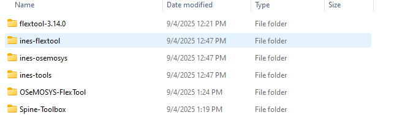
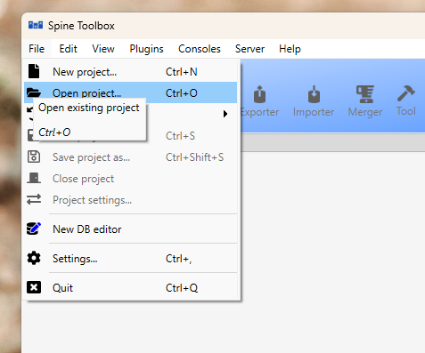
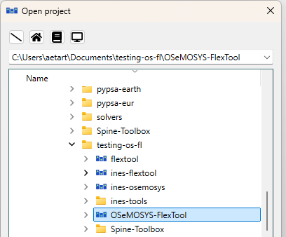
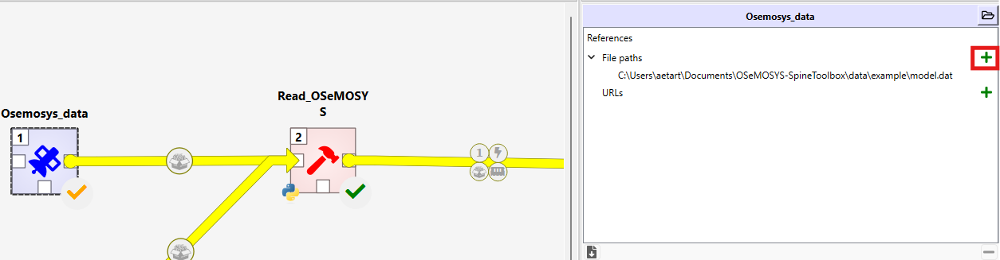
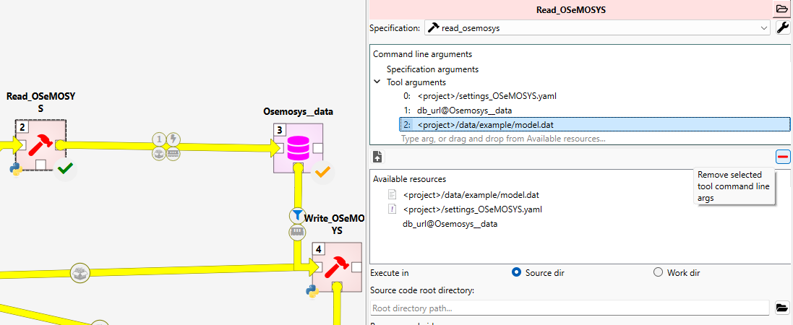
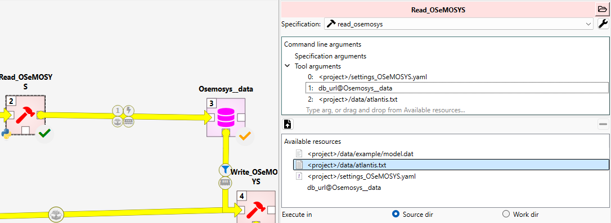
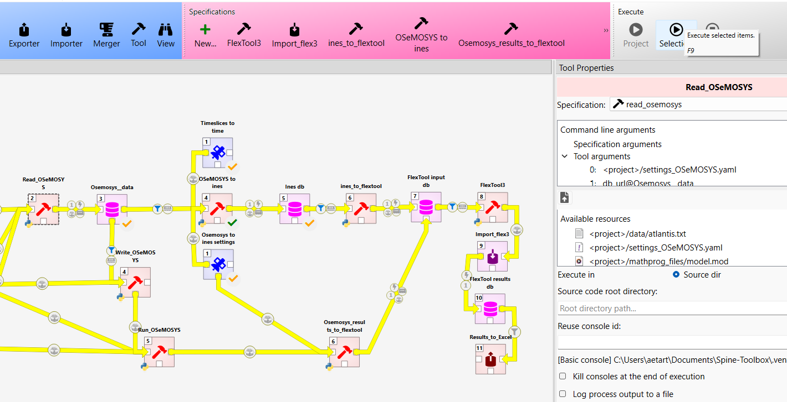
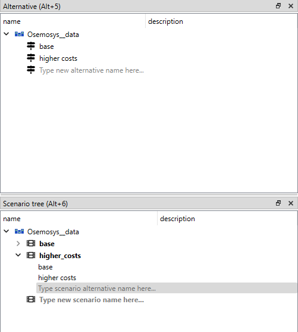
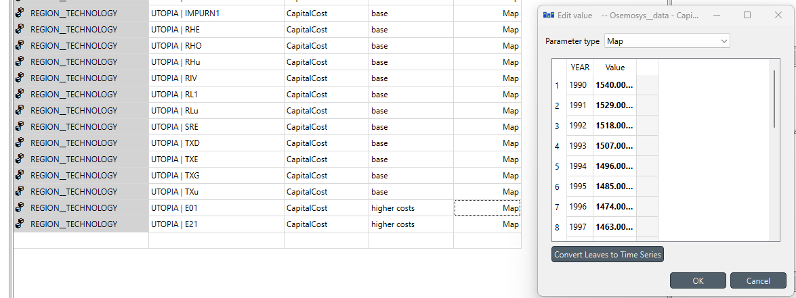
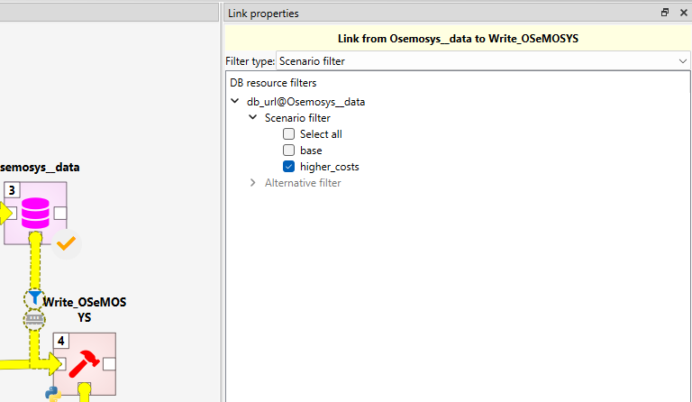

# OSeMOSYS-Flextool
## Integrating OSeMOSYS and IRENA FlexTool energy system models

The objective of this workflow is to provide an easy way to pass data between OSeMOSYS and IRENA FlexTool. This allows the testing of the flexibility of the system in IRENA FlexTool that the OSeMOSYS capacity expansion model has created.

The workflow includes transforming a OSeMOSYS model to FlexTool through INES specification (https://github.com/ines-tools/ines-spec), running OSeMOSYS as capacity expansion model, passing these results to FlexTool and running FlexTool

For this workflow, two transformations were added to the INES-tools. These are OSeMOSYS to INES specification:
https://github.com/ines-tools/ines-osemosys and from INES specification to FlexTool https://github.com/ines-tools/ines-flextool. Additionally, some generic functions are needed from INES-tools (https://github.com/ines-tools/ines-tools).

This workflow uses Spine-Toolbox for the database and workflow management (https://github.com/spine-tools/Spine-Toolbox)

For running the OSeMOSYS separately in Spine Toolbox go to: 
https://github.com/OSeMOSYS-FlexTool-integration/OSeMOSYS-SpineToolbox

The repository includes a copy of the OSeMOSYS code and glpsol for running OSeMOSYS. They are in the folders mathprog_files and glpsol_files respectively. For both, their original licences apply and are provided in their folders.

# Status

Functional, but not completely tested.

# Installation

## Installation with zip-files

Get the following zip-files and extract them to the same folder:

- Spine-Toolbox: https://github.com/spine-tools/Spine-Toolbox/releases/download/0.10.2/Spine-Toolbox-win-0.10.2.zip
- FlexTool: https://github.com/irena-flextool/flextool/archive/refs/tags/v3.14.0.zip
- The rest are in the zip-file located in the release: https://github.com/OSeMOSYS-FlexTool-integration/OSeMOSYS-FlexTool/releases/download/v0.1.0/OSeMOSYS-FlexTool.zip

The folder contents should look like:

You should have also an editor to produce OSeMOSYS inputfiles, get one you like to use:
http://www.osemosys.org/interfaces.html

You can open the spine-toolbox from the executable file under the spine-toolbox folder.
 

## Installation with git
Git clone this repository.

Additionally, git clone these three repositorys to parallel folders:

- INES-OSEMOSYS: https://github.com/ines-tools/ines-osemosys
- INES-FlexTool: https://github.com/ines-tools/ines-flextool
- INES-tools: https://github.com/ines-tools/ines-tools

Get IRENA FlexTool from:
https://github.com/irena-flextool/flextool

The workflow is done using Spine-Toolbox. Read the installation instructions from:
https://github.com/spine-tools/Spine-Toolbox

You should have also an editor to produce OSeMOSYS inputfiles, get one you like to use:
http://www.osemosys.org/interfaces.html

# Use

The workflow is used through Spine-Toolbox, open it. If you are using zip-installation, you should see spinetoolbox.exe under the Spine-Toolbox folder.

Open the OSeMOSYS-FlexTool project.

Choose the OSeMOSYS-FlexTool folder.

This workflow assumes that the user has a functioning OSeMOSYS model. More specifically, the text file input that is passed to the OSeMOSYS for solving. The path to this file needs to be added to the OSeMOSYS_data dataconnection.

1. Click `Osemosys_data`. Add file path by clicking the green plus symbol. Find your input file.

    
2. Click `Read_OSeMOSYS`. Remove the old path from the third argument by clicking it and the red minus symbol. Drag the new path from the available resources as the "2:" argument. (Note that these are just paths to a file. You can change the contents of the file without having to do this again.)
    
    
    
3. Run `Read_OSeMOSYS`.
    
4. Before running `OSeMOSYS to Ines` one might need to modify `Timeslices to Time` or `OSeMOSYS to ines settings`. You can open them by double clicking the file path or just searching them from the folder.
    + `Timeslices to Time` contains the timeline to be created and the timeslice corresponding to each timestep. 
        + The INES-spec requires real timestamps. However, as the years use a common yearly timeline in FlexTool it does not really matter which year you are using for the timestamps.  
        + It will create timeseries using the value from that timeslice. As you will probably replace these averaged timeseries with the better ones later, it does not matter that much which timeslice you are using. 
        + An example full year csv-file comes with this repository. So you really don't need to modify this file, unless you want to use different step length than 1 hour.
    + `OSeMOSYS to ines settings`  contains generic data settings for the transformation.
        + Default values for the data that does not exist. For example, default unitsize and unlimited_unit_capacity.
        + Unit conversion factors. The OSeMOSYS supports free units, but for the Ines and FlexTool these are fixed. Check what units you are using and if you need to change the factors.
5. Run `OSeMOSYS to Ines` and `ines_to_flextool`. You can check how the INES data looks like, but you won't need it. Now you should have transformed the OSeMOSYS model to FlexTool. 

6. Add timeseries. As a timeslice model, OSeMOSYS does not include timeseries, but they are essential for flexiblity considerations. Some parameters should be given timeseries values. The transformation already created the timeseries in correct format, but the values are just the timeslice value repeated for each timestep. The timeseries you should add are:
    + Demand: The parameter is node -- `inflow`
    + VRE production profiles: profile -- `profile` 
    + Other parameters can also have timeseries values, but these are the minimum required to perfrom flexibility analysis

At this point you should familiarize yourself with the use of the FlexTool: https://irena-flextool.github.io/flextool/tutorial/ . Note that you have installed the FlexTool already, so if you want its standalone workflow for the tutorial. Just open the FlexTool folder as spinetoolbox project.

Next we will replace the initial capacities with the results of the OSeMOSYS. To do this:

7. Run `Write_OSeMOSYS`. This creates a new osemosys input file. The filename can be changed from the osemosys settings.
8. Run `Run_OSeMOSYS`.
9. Run `OSeMOSYS_results_to_flextool`. This replaces the capacity values in the flextool input database with the results.
10. Now you are ready to run `Flextool3` and `Import_flex3`. These will create the flextool results to `FlexTool results db`
11. You can look at the results from the database directly or export them to excel format.
12. If the results include upward penalties, the system is not flexible enough to cover the situations where the VRE production is low or the demand is high.

13. (OPTIONAL) The `Osemosys__data` database contains your osemosys data in database format. You can use the database editor for creating scenarios and data differentiating them. You can do it by:

    + Create a new alternative
    + Create a new scenario
    + Add the base scenario and the new alternative to this new scenario. The lower alternatives in the list override higher ones.
    
    
    
    + Add data to this new alternative by adding rows to the data but using the new alternative in the alternative name column. Check from the data format from the base
    
    

    +  Commit changes
14. (OPTIONAL) Choose the new scenario from the filter selection. Running multiple scenarios at the same time is currently not supported.

    

# On timeseries 

The demand is presented in the flextool as 'scale_to_annual_flow'. This means that the 'inflow' timeseries only describes the profile of the demand. This is then scaled so than the annual sum of demand matches the 'annual_flow' parameter. It is transformed from the OSeMOSYS data. In practice, this means that the inflow parameter can be a fraction profile or a real demand timeseries of one year.

The VRE-profile instead needs to be a fractional (0-1) of the capacity. The transformation will create a profile, but this made by using the timeslice value corresponding to the timestep. Using these is not advisable as they are averages, and would create too optimistic view of the flexibility of the system.  

# Missing conversions from OSeMOSYS data to ines-spec (these are ignored at the moment)
The large concepts missing are mode of operation and reserves. The transformation will only take the first of the modes of operation. INES or FlexTool do not have representation of two separate points of efficiency curve and costs.
Reserves are completely missing. The reason is that the reserve formulation in OSeMOSYS is too broad and with too many options for the user. This prevents the automatic transformation. However, one can create reserves in FlexTool.

Below is a list of parameters that are not transferred:

- REGION
  - ReserveMargin
  - DepreciationMethod
- REGION__FUEL
  - ReserveMarginTagFuel
- REGION__TECHNOLOGY
  - AvailabilityFactor  (In OSeMOSYS this is annual value, while CapacityFactor is also for timeslices - we only take CapacityFactor at the moment)
  - ReserveMarginTagTechnology
- REGION__REGION__FUEL:
  - TradeRoute
